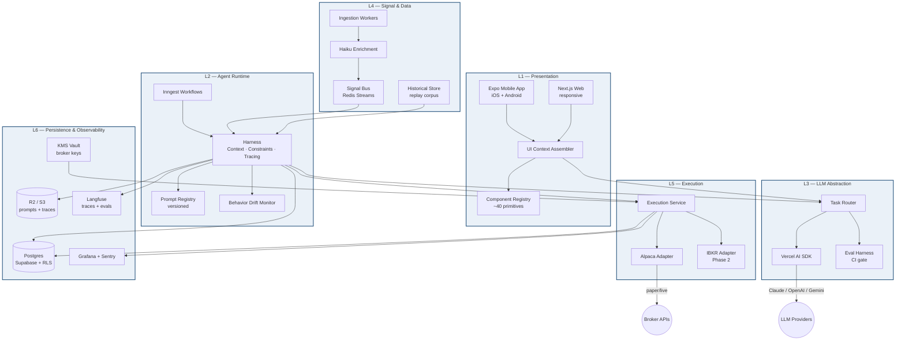
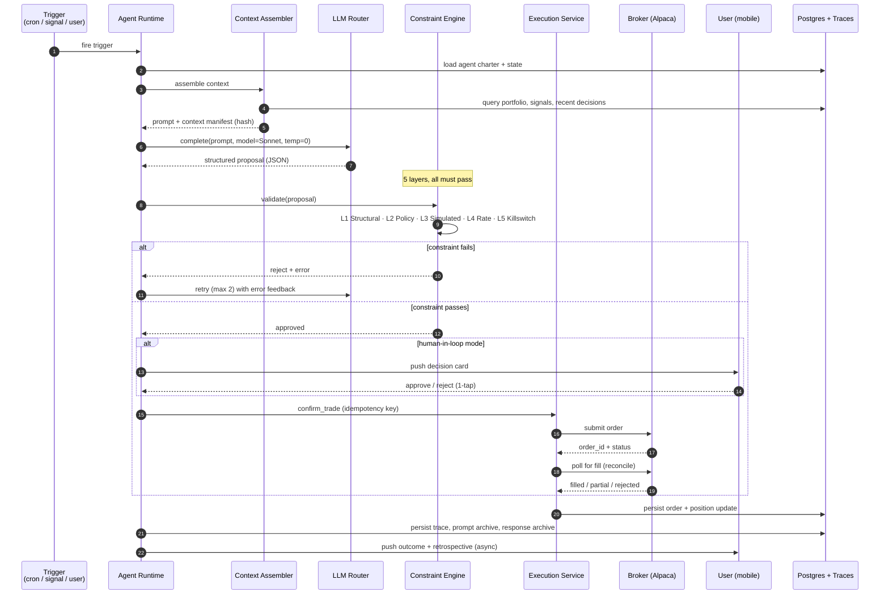
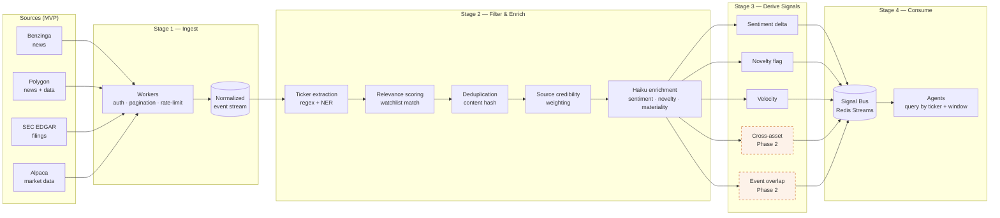
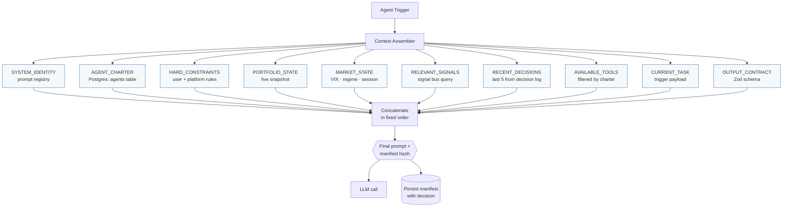
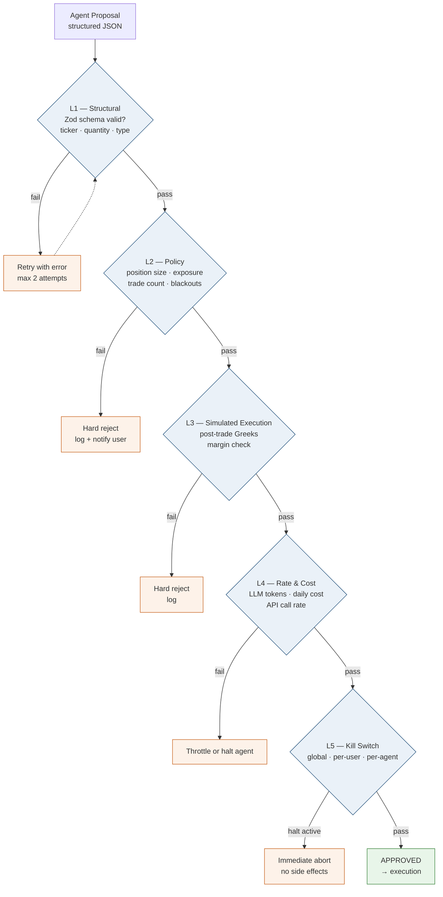
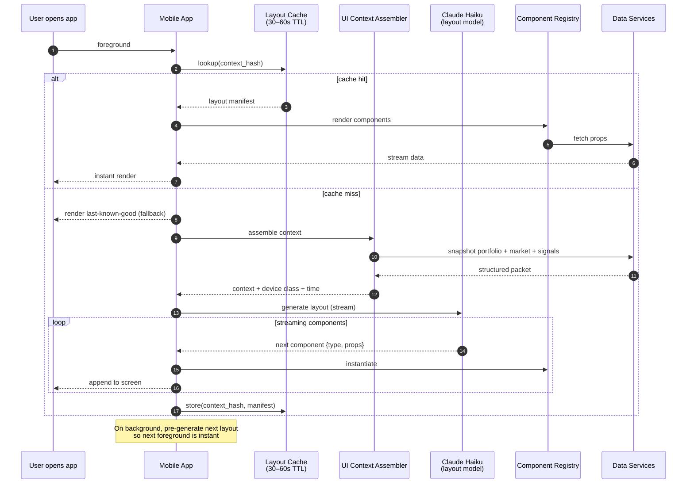
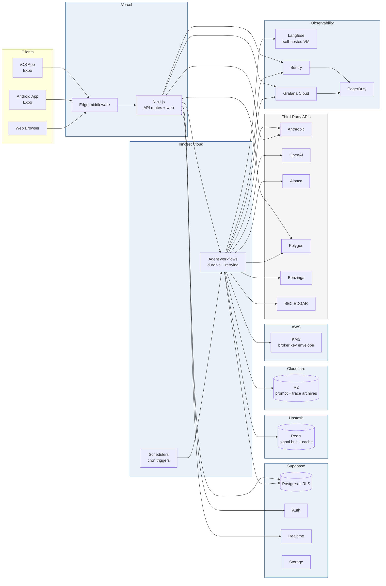
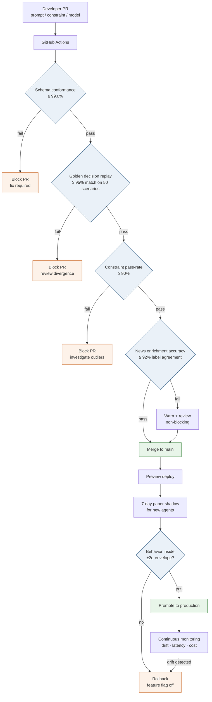
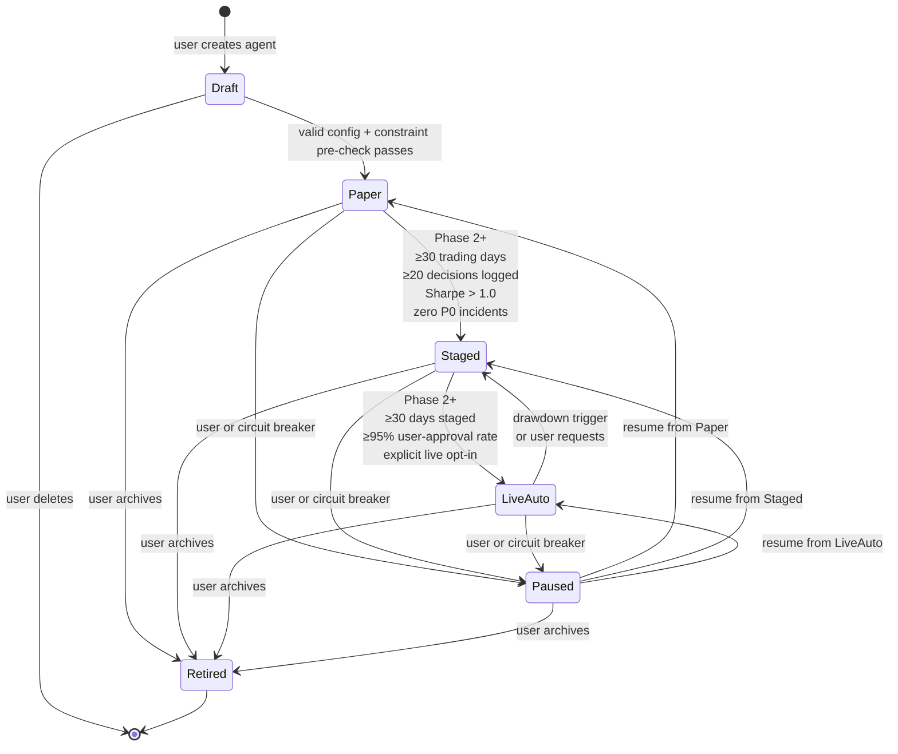
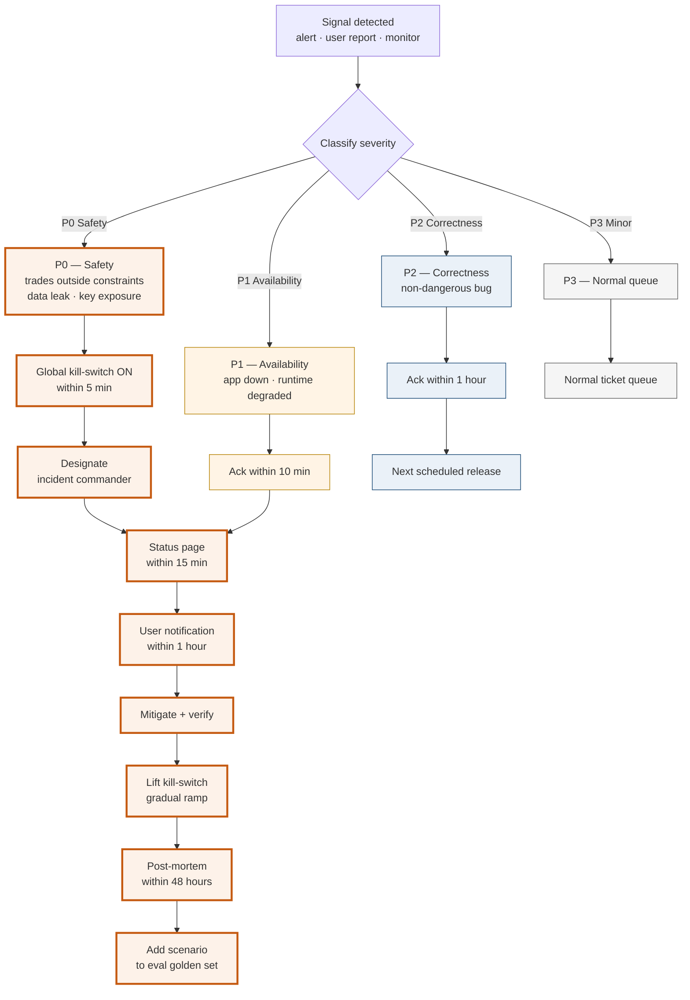

# folio.e8e — Architecture Diagrams

Companion to *folio.e8e — Solution Architecture & MVP Build Plan v1.1*. Every diagram below maps to a section of that document. Use alongside the doc, not as a replacement.

---

## 1. System Architecture — Six Layers

*Reference: §3.1*

Layered view of the platform. Each layer has a single responsibility and a clean interface to the layers above and below.

---

## 2. Agent Decision Sequence — Trigger to Execution

*Reference: §3.2, §4.1–4.5*

The full lifecycle of a single decision, including constraint gates and the two-phase commit for high-stakes actions.

---

## 3. Signal Pipeline — Ingestion to Consumption

*Reference: §5.1*

Four-stage pipeline converting noisy external feeds into structured, scored signals agents consume.

---

## 4. Context Assembler — Section Flow

*Reference: §4.1*

Deterministic prompt assembly. Each section is a pure function returning string plus manifest entry. The LLM never chooses its own context.

---

## 5. Constraint Engine — Five Safety Layers

*Reference: §4.2, §4.9*

Every agent proposal runs this gauntlet. Failure at any layer rejects the action.

---

## 6. Generative UI — Home Screen Composition

*Reference: §7.3, §7.4*

How an folio.e8e home screen gets composed on every app open. Streaming + caching + fallback make the magic fast.

---

## 7. Deployment Topology

*Reference: §8.1*

How the services physically live. All managed; no self-hosted infrastructure except Langfuse.

---

## 8. Eval & CI Gating Flow

*Reference: §6.5, §11.5*

How prompt, model, or constraint changes gate through evals before reaching production.

---

## 9. Agent Lifecycle — State Transitions

*Reference: §4.6*

States an agent moves through, with concrete exit criteria for each forward transition.

---

## 10. Incident Response Flow

*Reference: §10.4*

How a P0 is classified and resolved. Speed here is the product.

---

## How to use these

Embed in your internal wiki (Notion, Confluence, GitHub repo README), or render with any mermaid-capable viewer. Each diagram is deliberately minimal — enough to orient, not so much that it decays when the implementation evolves. Update alongside the architecture doc; diagrams that drift from the doc are worse than no diagrams.

Suggested pairing with the main doc:
- Diagrams 1–2 during architecture kickoff
- Diagram 3 when onboarding the data engineer
- Diagrams 4–5 when onboarding the AI/prompt engineer
- Diagram 6 when onboarding the mobile engineer
- Diagram 7 for infrastructure setup
- Diagram 8 when wiring CI
- Diagrams 9–10 during ops-readiness review (Week 10)
